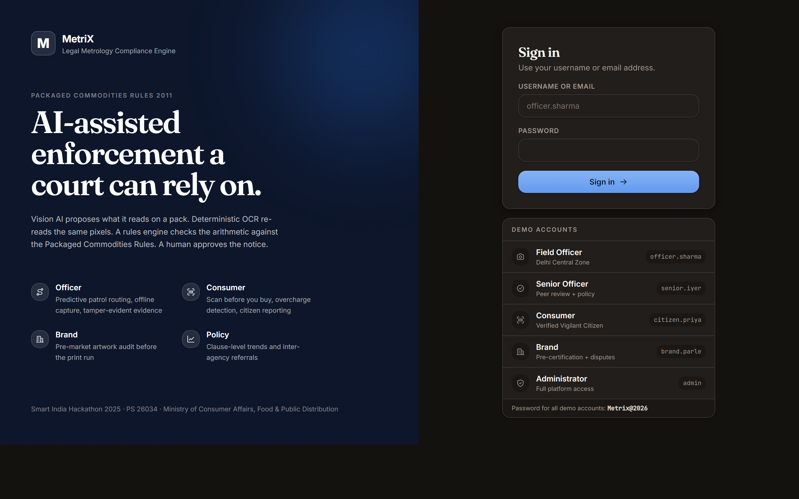
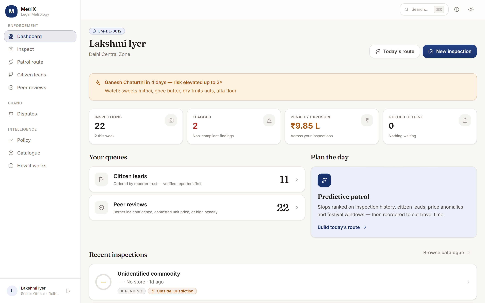
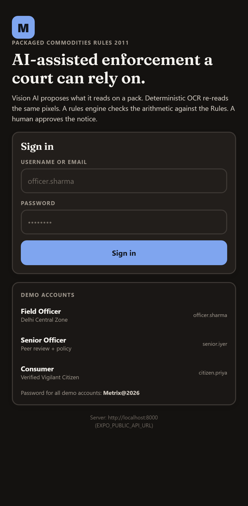
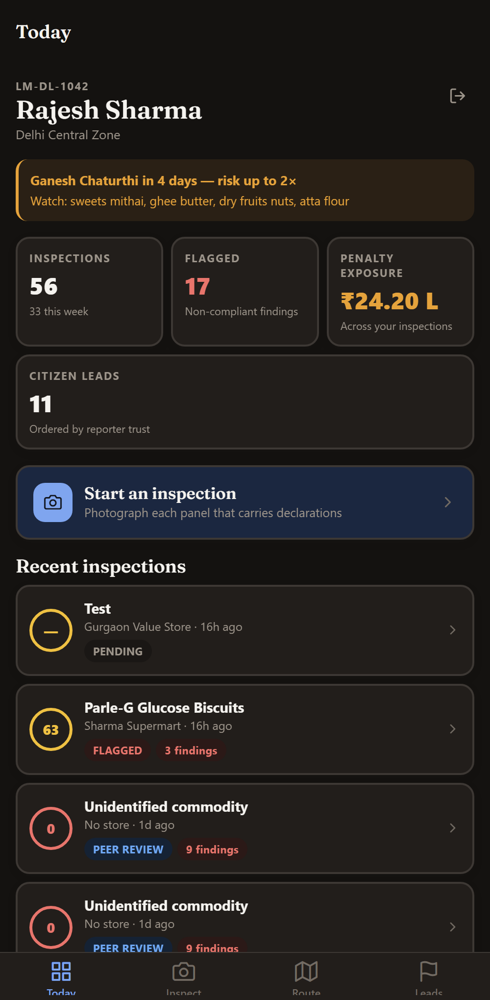

# MetriX — AI-Powered Legal Metrology Compliance Engine

**AI-Powered Legal Metrology Compliance Engine for Packaged Commodities**
SIH 2025 · PS **26034** · Ministry of Consumer Affairs, Food & Public Distribution · Team *Blue Layzz*

---

## Overview
MetriX is a comprehensive compliance engine designed to verify and enforce legal metrology rules for packaged commodities. It provides a robust, seamless ecosystem built as a **combination of a Web Application (for administrators and policy makers) and a Mobile Application (for on-ground officers and consumers)**.

*   **Web App (PWA):** Used by administrators for managing compliance policies, viewing the dashboard, reviewing reports, and tracking violations. Accessible securely from any browser.
*   **Mobile App:** Designed for field officers to easily capture imagery of packages, process them using AI for text/barcode extraction, and instantly check against metrology rules. It also acts as a portal for vigilant consumers to report non-compliant products.

### Screenshots

**Web App Interface**
<p align="center">
  
  
</p>

**Mobile App Interface**
<p align="center">
  
  
</p>

---

## Guide: How to Setup the Project on Another Laptop
This guide covers everything you need to run both the Web App and Mobile App locally.


## Quick start (zero infrastructure)

Nothing to install beyond Python. No Docker, no PostgreSQL, no Redis.

```bash
cd backend && ./.venv/Scripts/python.exe -m uvicorn app.main:app --reload --port 8000
```

Then open **http://localhost:8000/docs**.

On a fresh clone, create the environment first:

```bash
cd backend && python -m venv .venv --system-site-packages && ./.venv/Scripts/python.exe -m pip install -r requirements.txt
```

Windows PowerShell users can run `.\scripts\dev-backend.ps1`, which does both steps.

---

## Running the web app

Two terminals. Backend first:

```bash
cd backend && ./.venv/Scripts/python.exe -m uvicorn app.main:app --reload --port 8000
```

Then the PWA:

```bash
cd web && npm run dev
```

Open **http://localhost:5173**. Vite proxies `/api` and `/storage` to the backend,
so there is no CORS to configure.

On a fresh clone install the web dependencies first:

```bash
cd web && npm install
```

### Installing it as an app

The build emits a service worker and manifest, so the site is installable from
Chrome or Edge ("Install app" in the address bar) and from iOS Safari via
*Share → Add to Home Screen*. Installed, it opens standalone with the app shell
cached, which is what lets an officer open the capture screen with no signal.

### Testing on a phone on the same network

```bash
cd web && npm run dev -- --host
```

Vite prints a LAN address. The camera and geolocation APIs require a secure
context, so on a phone use `localhost` via port forwarding, or serve over HTTPS —
plain `http://192.168.x.x` will load the app but the browser will refuse camera
access.

---

## Android app (Expo)

The phone cannot reach the laptop's `localhost`, so the backend must bind to
all interfaces and the app must be told the LAN address.

```bash
cd backend && ./.venv/Scripts/python.exe -m uvicorn app.main:app --host 0.0.0.0 --port 8000
```

```bash
cd mobile && EXPO_PUBLIC_API_URL=http://<your-lan-ip>:8000 npx expo start
```

Install **Expo Go** on the phone and scan the QR code. Find the address with
`ipconfig`; it changes with the network. The login screen prints the address it
will call, so a connection failure shows the cause immediately.

For an installable APK (no Android SDK needed locally — it builds in the cloud):

```bash
cd mobile && npx eas-cli build --platform android --profile preview
```

See `mobile/README.md` for the screen map and the deliberate choices.

---

## Vision provider

The pipeline ships three real providers plus a deterministic mock. The mock does
genuine OCR rather than returning canned text, but it classifies lines by literal
keyword — so on a real hand-held photograph, where OCR mangles "M.R.P." as much
as it mangles the value, it finds almost nothing. It is for demoing the rules
engine on clean artwork, not for reading packs in a shop.

| Provider | Key | Notes |
|---|---|---|
| `claude` | `ANTHROPIC_API_KEY` | Project default. Best reader of curved, poorly-lit packs. |
| `gemini` | `GEMINI_API_KEY` | Needs `google-genai`. |
| `nvidia` | `NVIDIA_API_KEY` | Free credits from build.nvidia.com. OpenAI-compatible, no SDK needed. |
| `mock` | — | Offline fallback. Keyword OCR only. |

To use NVIDIA, get a key from https://build.nvidia.com, then in `.env`:

```
VISION_PROVIDER=nvidia
NVIDIA_API_KEY=nvapi-...
```

Confirm the model id on build.nvidia.com before relying on it — NIM identifiers
are renamed and retired more often than vendor SDK ones. Override with
`NVIDIA_VISION_MODEL` if the default has moved.

Restart the backend after changing `.env`. `/health` reports which provider is
actually live, and a provider that cannot start degrades to `mock` rather than
taking the pipeline down — the substitution is visible, not silent.

---

## Demo accounts

Every account uses the password **`Metrix@2026`**.

| Role | Username | Notes |
|---|---|---|
| Admin | `admin` | Full platform access |
| Officer | `officer.sharma` | Delhi Central Zone |
| Officer | `officer.verma` | Delhi South Zone |
| Officer | `officer.khan` | Delhi West Zone |
| Officer | `officer.reddy` | Gautam Buddh Nagar (Noida) |
| Senior Officer | `senior.iyer` | Peer-review queue |
| Senior Officer | `senior.chauhan` | Peer-review queue |
| Consumer | `citizen.priya` | Trust 92 — *Verified Vigilant Citizen* |
| Consumer | `citizen.ananya` | Trust 30 — low-priority reporter |
| Brand | `brand.parle` | Pre-certification + disputes |
| Brand | `brand.britannia`, `brand.fortune`, `brand.mdh`, `brand.haldiram` | |

---

## Rebuilding the demo data

```bash
cd backend && ./.venv/Scripts/python.exe -m seed.seed --reset
```

The seed is deterministic (RNG seed `26034`), so the same corpus is reproduced every run.

---

## Running the tests

```bash
cd backend && for t in smoke_phase0 test_preprocessing test_rules smoke_phase1 smoke_phase2; do ./.venv/Scripts/python.exe tests/$t.py; done
```

| Suite | Covers |
|---|---|
| `smoke_phase0.py` | Gateway, auth across 5 roles, token rules, registration guards |
| `test_preprocessing.py` | EXIF, curvature classification, unwarp, **coordinate round-trip**, px/mm scale |
| `test_rules.py` | All 13 rule modules against known-answer packs |
| `smoke_phase1.py` | Full officer workflow over HTTP: upload → pipeline → crops → seal → peer review |
| `smoke_phase2.py` | All four pillars: consumer scan + radar, citizen trust loop, patrol routing, brand sandbox + disputes, policy analytics, e-com, background workers |

The web app is typechecked and built with:

```bash
cd web && npm run typecheck && npm run build
```

### Regenerating the synthetic test packs

```bash
cd backend && ./.venv/Scripts/python.exe -m seed.synthetic --out ../storage/uploads/demo
```

Seven packs with known ground truth, from fully compliant to deliberately
non-compliant (missing declarations, undersized print, expired stock, a curved
bottle). These are what make the pipeline testable against fact rather than
eyeballed.

---

## Full production stack (Docker)

Brings up the exact architecture in the spec — PostgreSQL, Redis event bus, MinIO,
four Celery worker groups, beat scheduler and Flower.

```bash
docker compose up -d
```

Then seed it:

```bash
docker compose exec api python -m seed.seed --reset
```

| Service | URL |
|---|---|
| API + Swagger | http://localhost:8000/docs |
| Web app | http://localhost:5173 |
| MinIO console | http://localhost:9001 |
| Flower (Celery) | http://localhost:5555 |

`SECRET_KEY` must be set in `.env` before `docker compose up` — the compose file
refuses to start without it, deliberately, so a dev secret never reaches a deployment.

---

## Configuration

All settings live in `.env` (copy from `.env.example`). The ones that change behaviour most:

| Variable | Dev default | Production |
|---|---|---|
| `DATABASE_URL` | SQLite | `postgresql+asyncpg://...` |
| `TASK_BACKEND` | `inprocess` | `celery` |
| `STORAGE_BACKEND` | `local` | `minio` |
| `VISION_PROVIDER` | `mock` | `claude` |
| `PDF_ENGINE` | `auto` → reportlab | `weasyprint` |

Every one of these is an adapter swap, not a code path — the pipeline, rules engine
and routes are identical in both modes.

### Enabling Claude Vision

```bash
# in .env
VISION_PROVIDER=claude
ANTHROPIC_API_KEY=sk-ant-...
```

`.env` is gitignored. Never commit a key.

---

## Database migrations

SQLite auto-creates its schema at boot. PostgreSQL is managed by Alembic:

```bash
cd backend
./.venv/Scripts/python.exe -m alembic upgrade head          # apply
./.venv/Scripts/python.exe -m alembic revision --autogenerate -m "message"
```

---

## Health & diagnostics

| Endpoint | Purpose |
|---|---|
| `GET /health` | Liveness + which adapters are bound |
| `GET /health/capabilities` | Which optional subsystems (OpenCV, OCR, WeasyPrint, Celery) are actually available in this process |
| `GET /docs` | Interactive Swagger UI |

`/health/capabilities` is the fastest way to diagnose "why is feature X behaving differently here".

---

## Repository layout

```
SIH/
├── backend/            FastAPI gateway, rules engine, workers
│   ├── app/            config, database, gateway, celery app
│   ├── core/           security, storage, task runner, deps
│   ├── models/         15 ORM tables (spec §4)
│   ├── routes/         API surface (spec §6)
│   ├── preprocessing/  EXIF, curvature, unwarp, coordinate mapping
│   ├── extraction/     vision LLM, OCR verify, barcode, GS1
│   ├── rules/          10 compliance rule modules
│   ├── intelligence/   radar, routing, e-com, agency graph
│   ├── tasks/          Celery / in-process task definitions
│   ├── reports/        PDF notice, certificate, policy report
│   ├── seed/           deterministic demo corpus
│   └── alembic/        PostgreSQL migrations
├── web/                React 18 + Vite PWA
│   ├── src/pages/      officer · consumer · brand · policy portals
│   ├── src/lib/        offline capture queue (IndexedDB), AR viewfinder
│   └── src/components/ shell, shared UI primitives
├── mobile/             Expo React Native (Android)
├── packages/shared/    TypeScript types + API client
├── storage/            local evidence store (dev)
└── docker-compose.yml  full production topology
```
